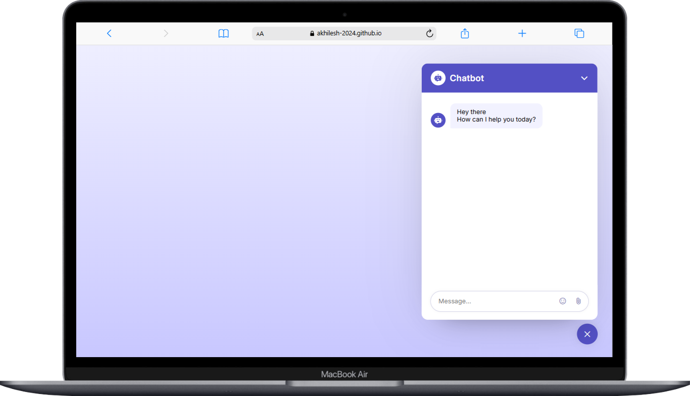

# 🚀 AI Chat Bot – Responsive Web Application

<p align="center">
  
</p>

<div align="center">
  
  
  
  
</div>

---

## ✨ Key Features

- **Responsive Design**
  - Mobile-friendly and adapts to all screen sizes
  - Clean, modern UI

- **Interactive Chat Bot**
  - Real-time chat interface
  - Smooth animations and transitions

- **Easy Customization**
  - Simple structure for quick updates
  - Well-organized codebase

---

## 🖥️ Demo

- **Local Preview:**  
  Open `index.html` in your browser to try the chat bot locally.

---

## 🛠️ Technologies Used

| Technology      | Purpose                        |
|-----------------|--------------------------------|
| HTML5           | Page structure                 |
| CSS3            | Styling and layout             |
| JavaScript      | Chat bot logic & interactivity |

---

## 📂 Project Structure

```
AI-Chat-Bot/
├── index.html
├── script.js
├── style.css
└── README.md
```

---

## 🚀 Getting Started

1. **Clone or download the repository.**
2. **Open `index.html` in your browser.**
3. **Start chatting with the AI bot!**

---

## 🌟 Special Features

- **Performance Optimized**
  - Lightweight and fast loading
  - Minimal dependencies

- **Accessibility**
  - Semantic HTML
  - Keyboard navigation support

- **SEO Ready**
  - Meta tags for better search visibility

---

## 📝 License

This project is licensed under the MIT License.

---

<div align="center">
  <sub>Developed with ❤️ by Akhilesh Jadhav</sub>
</div>
